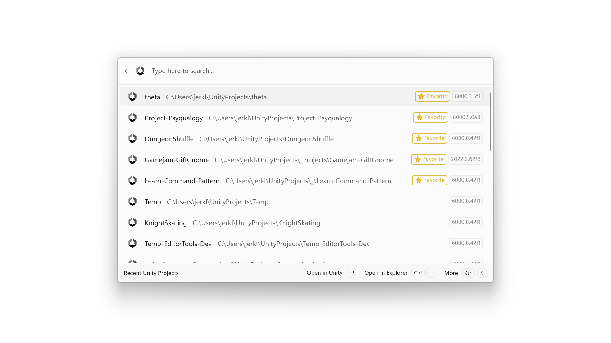

# Command Palette (CmdPal) Unity Extension

## Overview
Command Palette extension for opening Unity Hub recent projects.[^1]



## Installation

### Requirements
- [PowerToys](https://learn.microsoft.com/en-us/windows/powertoys/) with Command Palette enabled
- Unity Hub with recent projects history

> Unity Hub not required in background - extension launches editor directly.

### Recommended: Microsoft Store

Get it from the [Microsoft Store](https://apps.microsoft.com/store/detail/app/9NVSJZ72LTZ3).

### Via GitHub Releases

1. Remove any existing package:
   ```powershell
   Get-AppxPackage *CommandPalette-Unity* | Remove-AppxPackage
   ```
2. Download the `.msixbundle` from [Releases](https://github.com/maoyeedy/CmdPalUnityExtension/releases) and install.

## Contributing and development

Start here: [`CONTRIBUTING.md`](CONTRIBUTING.md)

Local workflow:

1. Build: `dotnet build UnityExtension.sln -c Debug -p:Platform=x64`
2. Register: `Add-AppxPackage -Register` against debug `AppxManifest.xml`
3. Restart PowerToys

Supporting docs:

- [`docs/DEVELOPMENT.md`](docs/DEVELOPMENT.md)
- [`docs/PUBLISHING.md`](docs/PUBLISHING.md)
- [`docs/TROUBLESHOOTING.md`](docs/TROUBLESHOOTING.md)

## TODO

- [x] Settings to sort/filter list output
- [ ] Visual Polish: resolve $HOME/~; remove 'Favorite' text
- [ ] Fallback dialog if editor not installed
- [ ] Open project with another Unity version
- [ ] Sub-command to list installed Unity versions + paths
- [ ] Overwrite timestamp in Unity Hub JSON

[^1]: Not affiliated with Unity Technologies. This extension only uses local Unity Hub json metadata.
